

# Seja bem vindo ao ScrumCloud !   

### Olá! Somos a equipe Tetris responsáveis pelo desenvolvimento do site ScrumCloud.

 

#    O Time 

A equipe Tetris é composta pelos seguintes estudantes do 3º semestre de Banco de Dados pela FATEC de São José dos Campos:

- ***Product Owner***
  - [Nágella Nasser](https://github.com/nagellanasser) [

](https://www.linkedin.com/in/nagellanasser/)  
- ***Scrum Master***
  - [Davi das Neves Machado](https://github.com/machadondavi) [

](https://www.linkedin.com/in/davinevesmachado/)
- ***Team Dev :***
  - [Alexia Karine Silva dos Santos](https://github.com/alexiakarine) [

](https://www.linkedin.com/in/alexia-karine-silva-5b0a79116/)
  - [Gabriel Oliveira Sana](https://github.com/gabsana) [

](https://www.linkedin.com/in/gabriel-sana-ba91a4147/)
  - [Guilherme de Oliveira Perfeito](https://github.com/guitambau) [

](https://www.linkedin.com/in/marcos-francisco-411800201)
  - [Jefferson Tavares de Araújo](https://github.com/jefferson-tavares-araujo) [

](https://www.linkedin.com/in/jeffersontavaresaraujo/)
  - [Nágella Nasser](https://github.com/nagellanasser) [

](https://www.linkedin.com/in/nagellanasser/)
  - [Renata Garcia Nonato](https://github.com/RenataGarciaNonato) [

](https://www.linkedin.com/mwlite/in/renata-garcia-2a84821b7)
  - [Valdiney José do Nascimento](https://github.com/Valdineynascimento) [

](https://www.linkedin.com/in/valdiney-jos%C3%A9-do-nascimento-68a136214/)

 

#  Scrum Cloud !
## :dart: Objetivo  
Desenvolver um sistema que permita que equipes remotas realizem algumas cerimônias do SCRUM.
As cerimônias para este projeto serão:
• Planning;
• Retrospective;
Este sistema pode permitir que pessoas cadastradas utilizem o sistema, montando equipes e armazenando os dados históricos referente às estimativas do Planning e das cerimônias de Retrospective.

 

## :pencil: Requisitos funcionais 
• Cadastros de Usuários contendo (Nome, e-mail e senha)  
• Existem dois perfis de usuário: 
	&nbsp;&nbsp;&nbsp;&nbsp;&nbsp;- Scrum Master 
	&nbsp;&nbsp;&nbsp;&nbsp;&nbsp;- Desenvolvedor  
• Por padrão, todos que se cadastram serão Scrum Masters  
• O Scrum Master após se cadastrar poderá criar seu time no sistema.  
• Ele poderá incluir um ou mais integrante em seu time  
• Ao inserir um integrante ele irá inserir o nome e o e-mail deste integrante  
• Após preencher os integrantes e salvar o time o sistema deverá disparar um e-mail para os integrantes realizarem o cadastro na plataforma.  
• Os usuários que forem cadastrados através do link que foi enviado por e-mail possuirão perfil de Dev naquele time em que ele foi convidado.  
• O Scrum Master poderá convidar uma pessoa para seu time copiando diretamente o link do time e enviando da maneira como preferir.
• O cadastro através do Link deverá possuir as mesmas mecânicas do cadastro por e-mail.  
• O sistema deverá permitir a criação das salas de Planning e de Retrospective  
• Na sala de Planning, deverá ser permitido inserir um ou uma lista de itens que serão estimados.  
• Para a estimativa deverá ser utilizada técnicas como Planning Poker utilizando ou por tamanhos relativos  
• Para o Planning Poker pode ser utilizada a frequência de Fibonacci ou as cartas padrão  
• O sistema deverá trabalhar com um sistema de rodadas, ou seja, todos os itens inseridos na lista de estimativa serão estimados um por vez.   
• Neste sistema de rodadas, item atual deverá ficar em evidência na tela para que todos consigam ler.  
• Um sistema de chat em texto deverá ser implementado para comunicação na sala de estimativas.  
• Os participantes deverão escolher a carta para a estimativa e após selecioná-la um sistema de indicador deverá exibir quantas pessoas já escolheram as cartas e quantas faltam.  
• O Scrum Master terá acesso a uma funcionalidade onde ele poderá finalizar a votação, fazendo com que todas as cartas selecionadas sejam exibidas para todos os participantes.  
• O Scrum Master poderá então atribuir um valor para o item da rodada.  
• O Scrum Master poderá prosseguir para a próxima tarefa ou retornar a anterior.  
• As estimativas deverão ser salvas, permitindo que os usuários possam exportar as tarefas estimadas, bem como os valores atribuídos para os itens.  
• Na sala de retrospectiva, deverá ser permitido que cada participante da sala insira itens para serem avaliados.  
• Cada participante poderá inserir quantos itens quiser nas seguintes categorias: 1–Parar de Fazer 2–Diminuir a Frequência 3–Manter a Frequência 4–Aumentar a frequência 5-Começar a fazer;  
• Um sistema de chat de texto deverá ser implementado para a sala de Retrospective;  
• Os usuários poderão sinalizar que terminaram de preencher os itens;  
• Um indicador deverá ser exibido para todos os participantes da sala contendo a informação de quantos participantes finalizaram e quantos faltam.  
• O Scrum Master deverá ter acesso a um botão para iniciar a votação  
• As rodadas da votação serão feitas por categorias.  
• Durante a votação, deverão ser exibidos o nome da categoria para todos os participantes, bem como todos os itens inseridos pelos participantes naquela categoria em questão.  
• Durante a votação os participantes poderão selecionar quais itens eles acham pertinente e sinalizar que finalizaram.  
• O Scrum Master poderá mover a votação para a próxima categoria e para a categoria anterior.  
• Após todas as categorias serem votadas um resumo de todas as categorias será exibida.  
• Neste resumo, somente os 3 itens mais votados serão exibidos por categoria.  
• O Scrum Master então poderá finalizar a retrospectiva consolidando os itens mais votados.  
• Ao finalizar a retrospectiva o resumo poderá ser exportado. 

  
 

## :heavy_check_mark: Funcionalidades 

.Disponibilizar de forma rapida as cerimonias do Scrum, e poder exporta-las para consulta durante a realização do projeto. 
 

## :dart: Público-alvo 

	.Times de desenvolvimento utilizando metodo agil do scrum para realização das cerimonias do scrum de forma rapida e organizada 

 

## :computer: Tecnologias utilizadas 

- Git
- GitHub
- IDE Eclipse || JAVA
- BootStrap
- ReactJS
- Hibernate
- HTML 5
- CSS
- Spring Framework
- Banco de Dados: MySQL 

 

## :email: Entregas 

- **SPRINT 1** :heavy_check_mark:
   - Product Backlog
   - Wireframes
   - User stories
   - Sprint planning
   - Criação da base da aplicação - frontend 
   - Criação da base da aplicação - backend
   - MER

    

- **SPRINT 2** :hourglass:
   - Permitir cadastro de Usuário
   - Permitir cadastro de Times de Desenvolvimento 
   - Disparar e-mails com links para cadastramento
   - Permitir criar sala de reunião
   - Permitir incluir itens para votação em reuniões de Planning
   - Permitir definir métrica de votação
   - Permitir encerramento da votação de um item
   - Gerar sugestão de valor para o item em questão pós encerramento de votação dele para o S.M.
   - Permitir definição de um valor ao item com votação encerrada

  

- **SPRINT 3** :hourglass:
   - Gerar link de reuniões marcadas para ser compartilhado
   - Permitir definir Scrum Master da reunião
   - Evidenciar na tela item em votação
   - Permitir conversa entre participantes
   - Permitir retornar ou avançar item da lista de votação
   - Permitir visualização de votos após encerramento de votação do item
   - Permitir incluir itens para votação em reuniões de Retrospective
   - Permitir sinalização de termino de inserção de itens por usuário nas reuniões de Retrospective

   

- **SPRINT 4** :hourglass:
   - Permitir exportar os item votados e seus valores
   - Permitir sinalização de termino de itens da categoria em questão discutida.
   - Permitir a sinalização de 0 ao número total de itens da categoria em questão discutida na reunião de Retrospective
   - Gerar um resumo de todas as categorias votadas com ênfase nos três itens mais votados de cada categoria
   - Permitir exportar resumo gerado ao final da reunião

   

## :page_with_curl: Product Backlog  

- 
   

 

## :chart_with_upwards_trend: Users Stories 

-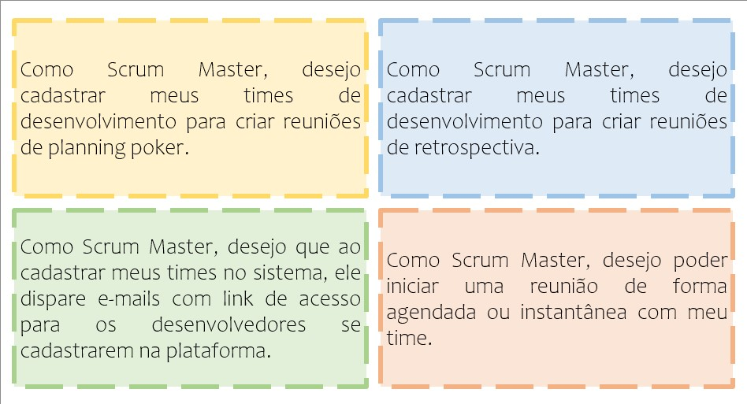
-
-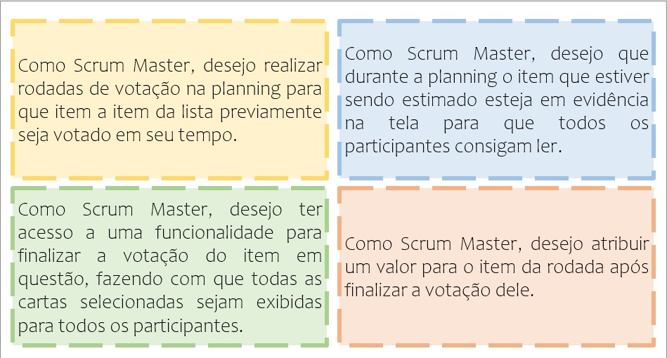
-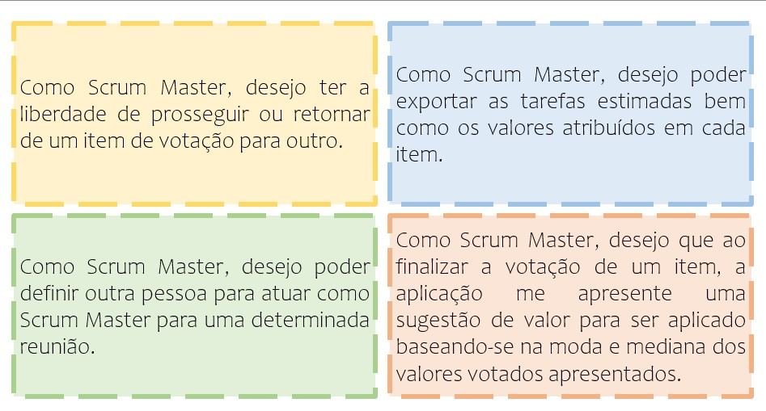
-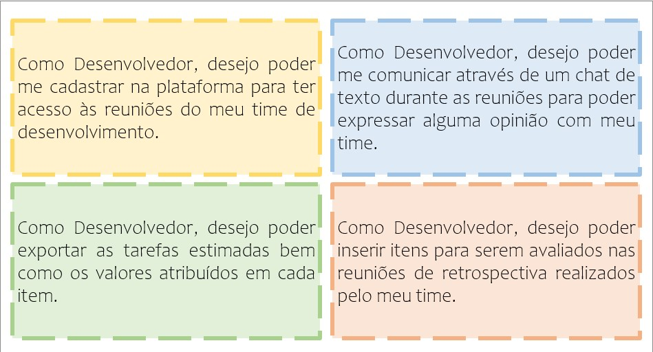
-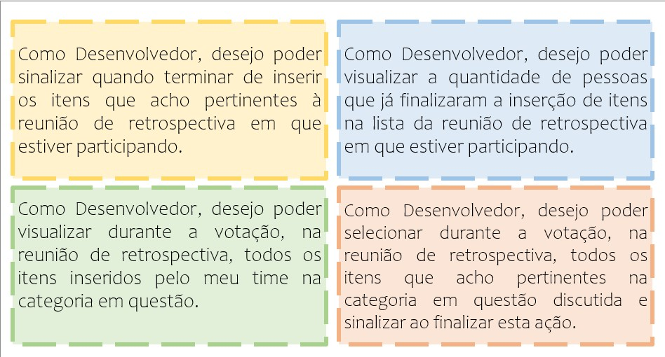
-

   

 

//## :pencil2: Modelagem Entidade-Relacionamento - MER 

- **Modelo Conceitual**
  
   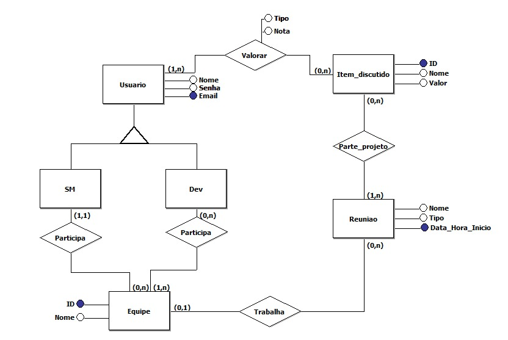
  

## :mortar_board: Wireframes 

- **01: Tela Login** *- Sujeita a modificações*
  - 
  

  - **02: Tela cadastro do Time**
  - 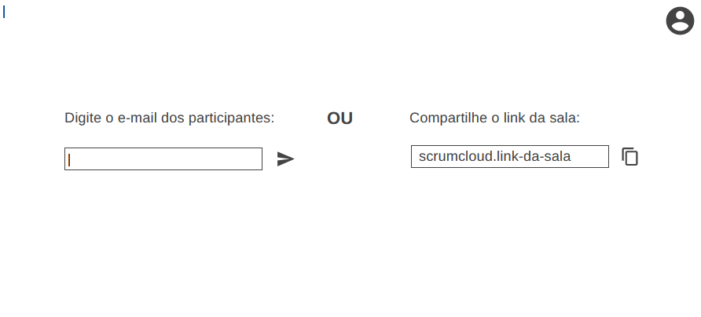
  

- **03: Tela cadastro usuário**
  - 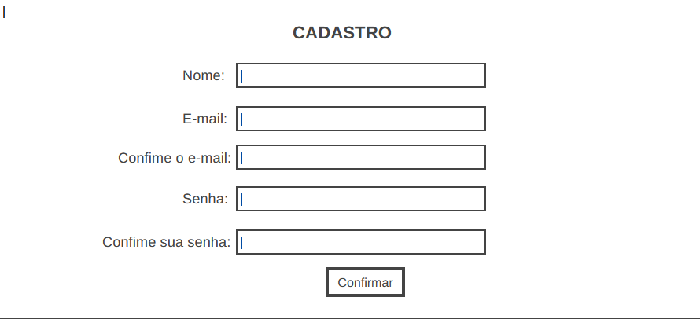
  

- **04: Tela Inicial**
  - 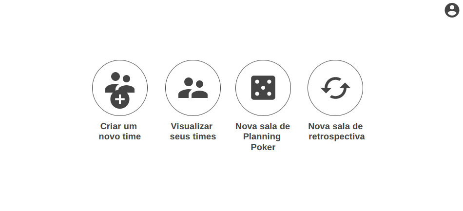
  

- **05: Tela retrospectiva DEV**
  - 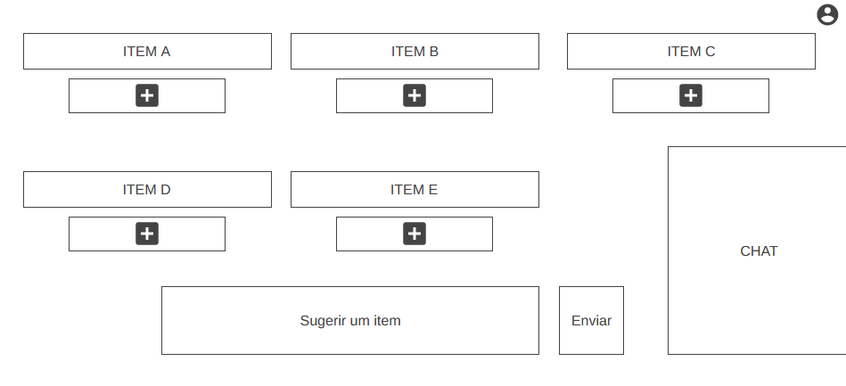
  

- **06: Tela retrospectiva SM**
  - 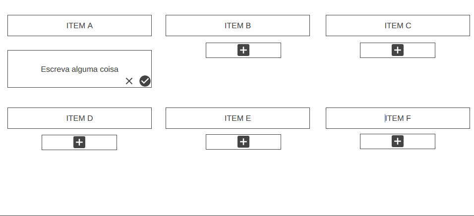
  

- **07: Tela Sala Planning Poker DEV**
  - 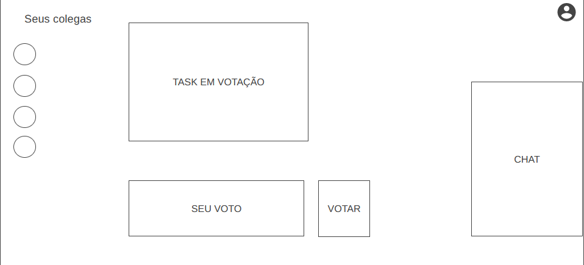
  

- **08: Tela Sala Planning Poker SM**
  - 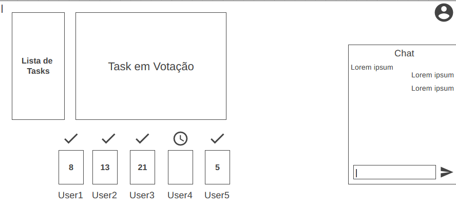
  

  

 

   

 

